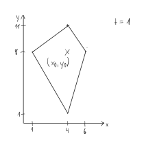
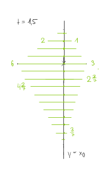

<h1 style="text-align: center;">Aufgabe 2: Verzinkt</h1>

Team-ID: 00968

Finn Rudolph

21. September 2022

## Lösungsidee

Die zu erzeugenden Bilder ähneln Voronoi-Diagrammen, mit dem Unterschied, dass sich ein Kristall unterschiedlich schnell in die vier Hauptrichtungen ausbreitet. Während das Voronoi-Diagramm einer Menge von Punkten erzeugt werden kann, indem man Kreise von jedem Punkt aus wachsen lässt, bis sie auf andere Kreise treffen, kann ein Kristall erzeugt werden, indem man ein Viereck von jedem Punkt aus wachsen lässt. Seien die Ausbreitungsgeschwindigkeiten (in Pixel pro Zeiteinheit) nach Nord, Süd, Ost und West (im Folgenden $n, s, o, w$ gennant) $n = 3, s = 7, o = 4, w = 2$. Dann sieht der Kristall nach einer Zeiteinheit wie folgt aus.

_Abbildung 1: Kristall mit Ausbreitungsgeschwindigkeiten $n = 3, s = 7, o = 4, w = 2$ nach $t = 1$ Zeiteinheiten._

Da die Ausbreitungsgeschwindigkeiten konstant sind, ist er nach zwei Zeiteinheiten nur eine um Längenfaktor $2$ skalierte Version von sicht selbt. Für das Bild der Ausbreitung mehrerer Kristalle wird angenommen, dass ein Kristall nicht um die Ecke wachsen kann. 

Die Idee des Algorithmus ist es, die Zeit schrittweise zu erhöhen und jeden Kristall um seinen Ursprung zu erweitern. Allerdings muss beim Zusammentreffen zweier Kristalle genau festgestellt werden können, welcher Pixel zu welchem Kristall gehört. Daher werden zu jedem Zeitpunkt $t$ alle Punkte, die im Kristall enthalten sind und bei $t-1$ noch nicht enthalten waren, zu einer Prioritätswarteschlange hinzugefügt. Die Punkte in der Warteschlange sind nach dem Zeitpunkt geordnet, an dem das Kristall, von dem ein Punkt hinzugefügt wurde, diesen gerade berühren würde. Im Folgenden wird ein Element in der Warteschlange auch Ereignis gennannt. Damit können zu jedem Zeitpunkt erst alle neu eingeschlossenen Punkte zur Prioritätswarteschlange hinzugefügt werden, und anschließend die Ereignisse in der richtigen Zeitfolge verarbeitet werden. Eine andere Möglichkeit wäre natürlich, einfach für jeden Punkt im Bild den Zeitpunkt des Berührens zu berechnen und alle solche Ereignisse nach der Zeitfolge zu verarbeiten. Jedoch beträgt die Zeit- und Speicherkomplexität damit mindestents $\Omega(n \cdot w \cdot h)$, wenn $n$ die Anzahl der Punkte, $w$ die Breite des Bilds in Pixeln und $h$ die Höhe des Bilds in Pixeln ist. Durch eine Verbesserung kann die Laufzeit weniger abhängig von der Anzahl an Punkten $n$ werden.

Die von einem Kristall eingeschlossenen Punkte können zu jeder Zeiteinheit mithilfe des Abstands von der vertikalen Geraden, die durch den Ursprung eines Kristalls verläuft, ermittelt werden. Der Ursprung des betrachteten Kristalls soll bei $(x_0, y_0)$ liegen. Durch den Zeitpunkt $t$ und die vier Ausbreitungsgeschwindigkeiten $n, s, o, w$ ist für jeden Punkt $(x_0, y)$ ein maximaler Abstand in die negative und positive $x$-Richtung definiert, die ein anderer Punkt haben darf, um im Kristall zu liegen. Im Beispiel von kann das folgendermaßen visualisiert werden. Für jedes ganzzahlige $y$ werden alle Punkte mit genau dieser $y$-Koordinate, die innerhalb des Kristalls liegen, farblich markiert. Die Endpunkte des entstehenden Segments geben die maximale Distanz an dieser $y$-Koordinate in negative und postitve $x$-Richtung an. Dafür sind einige Beispielwerte in Abbildung 2 angegeben.

_Abbildung 2: Visualisierung der maximalen $x$-Distanz eines Punkts von der Geraden $y = x_0$, um im Kristall zu liegen (für jedes ganzzahlige $y$)._

Allgemein kann die maximale $x$-Distanz einfach über die $y$-Koordinate des Punkts und die Steigung des relevanten Liniensegments berechnet werden. Für einen Punkt nordöstlich des Ursprungs des Kristalls ist beispielsweise nur das Liniensegment zwischen der nördlichen und östlichen Spitze des Kristalls relevant. 

## Laufzeitanalyse

## Implementierung

## Beispiele

## Quellen

- LodePNG. https://github.com/lvandeve/lodepng