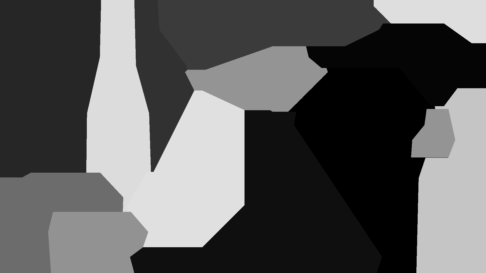

<h1 style="text-align: center;">Aufgabe 2: Verzinkt</h1>

<p style="text-align: center;">Team-ID: 00968</p>

<p style="text-align: center;">Finn Rudolph</p>

<p style="text-align: center;">25. September 2022</p>

**Inhaltsverzeichnis**

[TOC]

## Lösungsidee

Die zu erzeugenden Bilder ähneln Voronoi-Diagrammen, mit dem Unterschied, dass sich ein Kristall unterschiedlich schnell in die vier Hauptrichtungen ausbreitet. Während das Voronoi-Diagramm einer Menge von Punkten erzeugt werden kann, indem man Kreise von jedem Punkt aus wachsen lässt, bis sie auf andere Kreise treffen, kann ein Kristall erzeugt werden, indem man ein Viereck von jedem Punkt aus wachsen lässt. Seien die Ausbreitungsgeschwindigkeiten (in Pixel pro Zeiteinheit) nach Nord, Süd, Ost und West (im Folgenden $v_n, v_s, v_o, v_w$ gennant) $v_n = 3, v_s = 7, v_o = 2, v_w = 4$ und der Ursprungspunkt $(x_0, y_0)$. Dann sieht der Kristall nach einer Zeiteinheit wie folgt aus.


_Abbildung 1: Kristall mit Ausbreitungsgeschwindigkeiten $v_n = 3, v_s = 7, v_o = 2, v_w = 4$ nach $t = 1$ Zeiteinheiten._

Da die Ausbreitungsgeschwindigkeiten konstant sind, ist der Kristall nach zwei Zeiteinheiten nur eine um Längenfaktor 2 skalierte Version von sich selbst. Für das Bild der Ausbreitung mehrerer Kristalle wird angenommen, dass ein Kristall nicht um die Ecke wachsen kann. 

Die Idee des Algorithmus ist es, die Zeit schrittweise zu erhöhen und jeden Kristall um seinen Ursprung zu erweitern. Allerdings muss beim Zusammentreffen zweier Kristalle genau festgestellt werden können, welcher Pixel zu welchem Kristall gehört. Daher werden zu jedem Zeitpunkt $t$ alle Punkte, die in einem Kristall enthalten sind und bei $t-1$ noch nicht in diesem enthalten waren, zu einer Prioritätswarteschlange hinzugefügt. Die Punkte in der Warteschlange sind nach dem Zeitpunkt geordnet, an dem der Kristall, von dem ein Punkt hinzugefügt wurde, diesen gerade so berühren würde. Im Folgenden wird ein Element in der Warteschlange auch Ereignis genannt. Damit können zu jedem Zeitpunkt erst alle neu eingeschlossenen Punkte zur Prioritätswarteschlange hinzugefügt werden, und anschließend diese Ereignisse in der richtigen Zeitfolge verarbeitet werden. Eine andere Möglichkeit wäre, einfach für jeden Punkt im Bild den Zeitpunkt des Berührens von jedem Kristall aus zu berechnen und alle solche Ereignisse nach der Zeitfolge zu verarbeiten. Jedoch beträgt die Zeitkomplexität damit $\Theta(nwh \log(nwh))$, wenn $n$ die Anzahl der Punkte, $w$ die Breite des Bilds in Pixeln und $h$ die Höhe des Bilds in Pixeln ist. Durch eine Verbesserung kann in vielen Fällen jedoch eine deutlich bessere Laufzeit erzielt werden. (Die asymptotische Oberschranke bleibt jedoch.)

Die von einem Kristall eingeschlossenen Punkte können zu jeder Zeiteinheit mithilfe des Abstands von der vertikalen Geraden, die durch den Ursprung eines Kristalls verläuft, ermittelt werden. Der Ursprung des betrachteten Kristalls soll bei $(x_0, y_0)$ liegen. Durch den Zeitpunkt $t$ und die vier Ausbreitungsgeschwindigkeiten $v_n, v_s, v_o, v_w$ ist für jeden Punkt der Geraden $x = x_0$ ein maximaler Abstand in die negative und positive $x$-Richtung definiert, die ein anderer Punkt haben darf, um im Kristall zu liegen. Im Beispiel von oben kann das folgendermaßen visualisiert werden. Für jedes ganzzahlige $y$ werden alle Punkte mit genau dieser $y$-Koordinate, die innerhalb des Kristalls liegen, farblich markiert. Die Endpunkte des entstehenden Segments geben die maximale Distanz an dieser $y$-Koordinate in negative und postitve $x$-Richtung an. Dafür sind einige Beispielwerte in Abbildung 2 angegeben.


_Abbildung 2: Visualisierung der maximalen $x$-Distanz eines Punkts von der Geraden $y = x_0$, um im Kristall zu liegen (für jedes ganzzahlige $y$)._

Allgemein kann die maximale $x$-Distanz einfach über die $y$-Koordinate des Punkts und die Steigung der relevanten Seite des Vierecks berechnet werden. Für einen Punkt nordöstlich des Ursprungs des Kristalls ist beispielsweise nur die Seite zwischen der nördlichen und östlichen Spitze des Kristalls relevant. Seien $s_{no}, s_{nw}, s_{so}, s_{sw}$ die Beträge der Steigungen der nordöstlichen, nordwestlichen, südöstlichen und südwestlichen Seite. Dann ist die maximale $x$-Distanz eines Punkts mit $y = j$ nach Osten bei Zeitpunkt $t$ (angenommen der Kristall startet bei $t = 0$) 
$$
d_\max = \begin{cases}
v_o \cdot t - |j - y_0| \cdot s_{so} & \quad \text{if } j < y_0 \\
v_o \cdot t - |j - y_0| \cdot s_{no} & \quad \text{else}
\end{cases}
$$
Nach Westen verhält es sich ähnlich. An Zeitpunkt $t$ muss also für jedes $y: v_s \cdot t \le y \le v_n \cdot t$ mithilfe der genannten Beziehung für den maximalen $x$-Abstand jeder Punkt zur Warteschlange hinzugefügt werden, der bei $t-1$ noch ausßerhalb des maximalen $x$-Abstands war. Um den maximalen $x$-Abstand bei $t-1$ sofort zur Verfügung zu haben, werden für jeden Punkt zwei Arrays $\text{ost}$ und $\text{west}$ der Länge $h$ angelegt, in denen dieser gespeichert wird. Außerdem wird das Wachstum eines Kristalls ab einem bestimmten Zeitpunkt an einer $y$-Koordinate nicht mehr möglich sein - z. B. wenn er an den Bildrand oder einen anderen Kristall stößt. Auch diese Information wird in den Arrays abgespeichert. 

## Laufzeitanalyse

Die Oberschranke der Laufzeit ist, wie bereits genannt $O(nwh \lg(nwh))$. Begründet wird dass dadurch, dass jeder Pixel von jedem Ursprung aus maximal einmal zur Prioritätswarteschlange hinzugefügt werden kann. Die Unterschranke beträgt mit dem verbesserten Ansatz jedoch $\Omega(wh)$, da jeder Pixel mindestens einmal, aber nicht zwingend öfter, betrachtet werden muss. 

Insgesamt ist der verbesserte Ansatz ähnlich zur $\Theta(nwh \lg(nwh))$ Lösung, nur dass das Hinzufügen der Ereignisse zur Prioritätswarteschlange aufgeteilt wird und nicht auf einmal geschieht. Indem nicht alle Ereignisse sofort hinzugefügt werden, wird meistens nicht von jedem Ursprungspunkt aus jeder Pixel betrachtet, da bei Kollision mit einem zweiten Kristall in diese Richtung frühzeitig gestoppt wird.

## Implementierung

Das Programm wird in C++ geschrieben, zur Erstellung von PNG-Bildern wird die Bibliothek LodePNG (siehe Quellen) verwendet.

Um die Simulation einfach anpassbar zu machen, können Ursprungskoordinaten, Ausbreitungsgeschwindigkeiten, Startzeit und Farbe jedes Kristalls angegeben werden. Nicht angegebene Parameter werden zufällig gewählt. Die Geschwindigkeiten liegen bei zufälliger Wahl zwischen 1 und 9 Pixeln pro Zeiteinheit (Z. 80), die Startzeitpunkte zwischen 0 und $w / 64$ (Z. 96). Diese Werte haben sich experimentell als geeignet herausgestellt, um verschiedenartige, aber auch ausgeglichene Bilder zu erhalten. Auch die Abmessungen des Bilds können angegeben werden, standardmäßig werden sie auf $1920 \times 1080$ gesetzt. Breite und Höhe werden vertauscht, falls die Höhe größer als die Breite ist (Z. 200-201). Das verringert den Speicherverbrauch des Programms, da für jeden Knoten ein Array der Länge $h$ angelegt wird. Falls gewünscht, kann das ausgegebene Bild einfach wieder gedreht werden. Wenn die Ursprungskoordinaten der Punkte angegeben werden, werden die Abmessungen so gewählt, dass jeder Punkt mindestens 50 Pixel Abstand zum unteren und rechten Ende hat. Der Ursprung des Koordinatensystems ist in der oberen linken Ecke, die $y$-Achse verläuft ansteigend nach unten. Um auszuwählen, welche der genannten Größen manuell gesetzt werden sollen, können folgende Flags beim Ausführen des Programms in der Kommandozeile mitgegeben werden.

| Flag | Parameter                       |
| ---- | ------------------------------- |
| `-p` | Koordinaten der Ursprungspunkte |
| `-v` | Ausbreitungsgeschwindigkeiten   |
| `-t` | Startzeiten                     |
| `-c` | Farben                          |
| `-d` | Abmessungen des Bilds           |

Für jede der ersten vier Flags, die gesetzt ist, müssen dann jeweils $n$ Werte gegeben werden. Auch kann der Name der Datei des Ergebnisbilds als Argument in der Kommandozeile angegeben werden.

Der erste Teil der `main`-Funktion (Z. 167-270) kümmert sich nur um das Einlesen der Parameter bzw. zufällige Generieren. Da das nicht der Kern der Aufgabe ist, wird dieser Teil nicht erklärt. Auch die Funktionen in den Zeilen 54-99 gehören dazu.

Zunächst werden die für die Simulation nötigen Datenstrukturen angelegt (Z. 263-273). `res` enthält das Ergebnis der Simulation und wird danach an LodePNG gegeben. `diagram` dient dazu, schnell überprüfen zu können, ob ein Pixel zu einem Kristall gehört und zu welchem. `east` und `west` enthalten für jeden Ursprung die bereits angesprochenen Arrays, in denen der letzte nach Osten bzw. Westen eingeschlossene $x$-Wert für jeden $y$-Wert für jeden Kristall steht. `slopes` dient lediglich dazu, die Steigungen aller Liniensegmente nicht ständig neu berechnen zu müssen. `east` und `west` werden inital mit $x_0$ bzw. $x_0 -1$ befüllt, sodass `east` die Punkte auf $x = x_0$ mit einschließt (Z. 275-284).

Die folgende for-Schleife enthält die eigentliche Simulation (Z. 288-323). Bis alle Pixel einem Kristall zugeordnet sind sind, wird an jedem Zeitpunkt für jeden bereits gestarteten Ursprung zunächst die aktuellen Ausbreitung in die vier Hauptrichtungen berechnet (Z. 296-300). Da das Einfügen von Ereignissen nach Ost und West ähnlich ist, wird es in die Funktion `update_queue` verschoben, um Codewiederholung zu vermeiden. Unter ihren (sehr zahlreichen) Parametern sind viele selbsterklärend, nur einige sollen kurz erläutert werden: `last` ist entweder `east[i]` oder `west[i]`, `a` ist die $y$-Koordinate der südlichen und `b` die der nördlichen Spitze des Kristalls. `u` ist `v_o` bzw. `v_w` und `v` ist die Ausbreitungsgeschwindigkeit in Ost- bzw. Westrichtung. In `update_queue` werden für jedes $j : a \le j \le b$ alle neu hinzugekommenen Punkte in die Warteschlange eingefügt. Zunächst werden die $x$-Grenzen der zu betrachteten Punkte ermittelt: Das Ende kann durch oben genannte Beziehung errechnet werden, der Anfang ist noch in `last` gespeichert (Z. 118-125). Die umständliche Berechnung vermeidet Rundungsfehler mit Gleitkommazahlen. Die anschließende for-Schleife iteriert von der Geraden $x = x_0$ weg über alle einzufügenden $x$-Koordinaten (Z. 134-150). Es werden zwei Fälle unterschieden: Ist der Pixel noch frei, wird das als Ereignis hinzugefügt, andernfalls die Iteration abgebrochen, da der Kristall gegen einen anderen gestoßen ist. Zuletzt wird der zuletzt betrachtete $x$-Wert aktualisiert oder auf `INT_MIN` gesetzt, falls ein anderer Kristall entdeckt wurde. Der Ausdruck zur Errechnung des Zeitpunkts des Zusammenstoßes (Z. 138-141) ist leicht nachvollziehbar, in Abbildung 3 wird die Idee veranschaulicht. Sie zeigt den Fall eines Punkts, der nordöstlich des Kristallursprungs liegt. Die Idee ist, die $x$-Koordinate des Schnittpunks der Geraden $y = y_0$ mit der Geraden mit Steigung `slope_up`, die durch den Punkt verläuft zu berechnen. Diese geteilt durch $v_o$ ist der Zeitpunkt der Berührung.


_Abbildung 3: Skizze zur Berechnung des Berührungszeitpunkts eines Kristalls mit einem Punkt. Siehe Z. 138-141 im Quellcode._

Nachdem alle Kristallursprünge für den aktuellen Zeitpunkt verarbeitet wurde, wird die Prioritätswarteschlange geleert, sodass alle Ereignisse in richtiger Zeitfolge betrachtet werden (Z. 311-322). Wenn ein Pixel noch frei ist, wird die Farbe seines Kristalls in `res` gesetzt und in `diagram` an dieser Stelle der Index des Kristalls eingetragen. `set_color` findet sich in Z. 101-106, es setzt den R, G und B-Wert des Pixels auf den gleichen Wert, sodass ein Grauton entsteht. Der A-Wert (Alpha-Wert oder Transparenz) wird auf das Maximum gesetzt, da das Bild nicht transparent sein soll.

## Beispiele

Im Folgenden werden einige völlig zufällig erzeugt Kristallmuster gezeigt, sowie Beispiele für manuelles Wählen der Parameter. Dass die Anzahl tatsächlich sichtbarer Kristalle teilweise nicht mit $n$ übereinstimmt, liegt daran, dass ein Kristallursprung bereits vor seinem Startzeitpunkt von einem anderen Kristall überdeckt wird und so nicht im Bild erscheint.

### Zufällige Parameter

#### kristallmuster0.png

$n = 5$


#### kristallmuster1.png

$n = 14$



#### kristallmuster2.png

$n = 42$


#### kristallmuster3.png

$n = 197$


### Manuelle Parameter

#### kristallmuster4.png

In diesem Beispiel werden die Startpunkte und Startzeiten manuell gewählt. Es gilt $n = 6$, die Werte der Startpunkte und -zeiten sehen wie folgt aus (eine Zeile entspricht einem Kristallursprung).

| Startpunkt     | Startzeit |
| -------------- | --------- |
| $(100, 100)$   | $0$       |
| $(1920, 1080)$ | $0$       |
| $(427, 870)$   | $0$       |
| $(1540, 35)$   | $0$       |
| $(1024, 512)$  | $0$       |
| $(2, 1000)$    | $0$       |


Zur Erinnerung, das Koordinatensystem beginnt links oben und die positive Richtung der $y$-Achse zeigt nach unten. Alle sechs Regionen sind erkennbar, wenn auch die ausgehend von $(2, 1000)$, links unten zu erkennen, relativ klein wurde.

#### kristallmuster5.png

Nun sollen alle vier Parameter manuell gewählt werden. Es gilt $n = 8$. Die Ausbreitungsgeschwindigkeit wird als 4-Tuple angegeben, geordnet nach Nord, Süd, Ost, West.

| Startpunkt    | Ausbreitungsgeschwindigkeit | Startzeit | Farbe |
| ------------- | --------------------------- | --------- | ----- |
| $(1, 1)$      | $(1, 7, 8, 2)$              | $0$       | $0$   |
| $(100, 50)$   | $(4, 7, 2, 1)$              | $4$       | $255$ |
| $(729, 81)$   | $(1, 1, 1, 1)$              | $2$       | $127$ |
| $(812, 1013)$ | $(9, 8, 7, 6)$              | $8$       | $40$  |
| $(1776, 800)$ | $(1, 5, 2, 3)$              | $1$       | $79$  |
| $(1430, 197)$ | $(2, 3, 5, 7)$              | $6$       | $196$ |
| $(1000, 500)$ | $(1, 2, 4, 8)$              | $3$       | $233$ |
| $(333, 963)$  | $(2, 6, 1, 5)$              | $14$      | $25$  |


Alle acht Regionen sind erkennbar. Beispielsweise ist das schwarze Eck links oben von Punkt 1, die große hellgraue Region oben rechts von Punkt 6 oder die große, dunkelgraue Region unten mittig von Punkt 4.

#### kristallmuster6.png und kristallmuster7.png

Im letzten Beispiel werden nur die Geschwindigkeiten gesetzt, und zwar alle auf 1. Damit ist das entstehende Bild gleich einem Voronoi-Diagramm mit $L_1$- oder Manhattan-Distanz als Distanzfunktion. Die Distanz zweier Punkte unter Manhattan-Distanz beträgt $|x_1 - x_2| + |y_1 - y_2|$. Im folgenden Bild (kristallmuster6.png) gilt $n = 12$.


Folgendes Bild (kristallmuster7.png) hat $n = 21$.


### Erzeugung ähnlicher Bilder zum gegebenen Bild

Hier soll die Frage behandelt werden, mit welchen Parametern man ähnliche Bilder zu dem auf dem Aufgabenblatt gegebenen bekommt. Grundsätzlich ähneln die hier erzeugten Bilder mit großem $n$ (z. B. kristallmuster3.png) diesem, nur sind hier die Kontraste wesentlich stärker. Durch Verkleinerung des Bereichs, in dem zufällige Farben erzeugt werden, konnte folgendes Bild (kristallmuster8.png) erzeugt werden, das dem gegebenen schon sehr nahe kommt. Es gilt $n = 169$.


## Quellcode

```cpp
#include "lodepng.h"

#include <memory.h>
#include <iostream>
#include <queue>
#include <climits>
#include <vector>
#include <set>
#include <cmath>

enum options
{
    POINTS = 1,     // -p
    VELOCITY = 2,   // -v
    TIME = 4,       // -t
    COLOR = 8,      // -c
    DIMENSIONS = 16 // -d
};

struct point
{
    int x, y;

    // Gibt den Index im Ergebnisbild zurück.
    size_t get_index(int width)
    {
        return (y * width + x) * 4;
    }
};

struct vel
{
    int n, s, o, w;
};

struct slope
{
    double nw, sw, no, so;
};

struct event
{
    point p;
    double t;
    size_t i;
    uint8_t c;

    bool operator<(event const &e) const
    {
        return t > e.t;
    }
};

// Gibt eine zufällige Ganzzahl in [min, max) zurück.
inline int rand_range(int min, int max)
{
    return (std::rand() % (max - min)) + min;
}

std::vector<uint8_t> gen_colors(size_t n)
{
    std::vector<uint8_t> colors(n);
    for (uint8_t &c : colors)
        c = rand_range(0, 255);
    return colors;
}

std::vector<point> gen_points(size_t n, int width, int height)
{
    std::vector<point> points(n);
    for (point &p : points)
    {
        p.x = rand_range(0, width);
        p.y = rand_range(0, height);
    }
    return points;
}

std::vector<vel> gen_velocities(size_t n)
{
    int const v_min = 1, v_max = 10;
    std::vector<vel> velocities(n);
    for (vel &v : velocities)
    {
        v.n = rand_range(v_min, v_max);
        v.s = rand_range(v_min, v_max);
        v.o = rand_range(v_min, v_max);
        v.w = rand_range(v_min, v_max);
    }
    return velocities;
}

std::vector<int> gen_times(size_t n, int width)
{
    std::vector<int> times(n);
    for (int &t : times)
        t = rand_range(0, width / 64);
    return times;
}

inline void set_color(std::vector<uint8_t> &res, int width, point p, uint8_t c)
{
    for (size_t i = 0; i < 3; i++)
        res[p.get_index(width) + i] = c;
    res[p.get_index(width) + 3] = 255;
}

void update_queue(
    std::priority_queue<event> &q,
    std::vector<int> &last,
    std::vector<std::vector<size_t>> &diagram,
    int width, int height,
    int a, int b, int x, int y, int u, int v, uint8_t c,
    double slope_down, double slope_up, int start_time, size_t i, bool west)
{
    for (int j = std::max(0, a); j <= b && j < height; j++)
    {
        double d = (double)abs(j - y) * (j < y ? slope_down : slope_up);
        if (abs(d - std::round(d)) < 1e-6)
            d = std::round(d);
        else
            d = std::ceil(d);

        int xend = x + u - d;
        int xbegin = last[j];

        if ((!west && xbegin >= width) || (west && xbegin < 0) || xbegin == INT_MIN)
            continue;

        if (west)
            xend = 2 * x - xend;

        bool can_continue = 1;
        for (int k = xbegin; (west ? k >= xend : k <= xend) && k < width && k >= 0; k += (west ? -1 : 1))
        {
            if (diagram[k][j] == SIZE_MAX)
            {
                double t = ((double)abs(k - x) +
                            (double)abs(j - y) *
                                (j < y ? slope_down : slope_up)) /
                           (double)v;
                q.push({{k, j}, t + (double)start_time, i, c});
            }
            else
            {
                // Der Kristall ist seitlich gegen einen anderen gestoßen.
                can_continue = 0;
                break;
            }
        }

        last[j] = can_continue ? (west ? xend - 1 : xend + 1) : INT_MIN;
    }
}

int main(int argc, char **argv)
{
    char fname[40] = "kristallmuster.png";
    unsigned op = 0;

    for (int i = 1; i < argc; i++)
        if (!strcmp(argv[i], "-p"))
            op |= POINTS;
        else if (!strcmp(argv[i], "-v"))
            op |= VELOCITY;
        else if (!strcmp(argv[i], "-t"))
            op |= TIME;
        else if (!strcmp(argv[i], "-c"))
            op |= COLOR;
        else if (!strcmp(argv[i], "-d"))
            op |= DIMENSIONS;
        else
            strcpy(fname, argv[i]);

    std::vector<point> points;
    std::vector<vel> velocities;
    std::vector<int> times;
    std::vector<uint8_t> colors;
    int width = 0, height = 0;

    size_t n;
    std::cout << "Anzahl an Punkten: ";
    std::cin >> n;

    srand(time(0));

    if (op & DIMENSIONS)
    {
        std::cout << "Dimensionen des Bilds [Breite Höhe]:\n";
        std::cin >> width >> height;
        if (height > width)
            std::swap(height, width);
    }

    if (op & POINTS)
    {
        std::cout << "Koordinaten der Punkte [x y]:\n";
        int x_max = 0, y_max = 0;
        for (size_t i = 0; i < n; i++)
        {
            int x, y;
            std::cin >> x >> y;
            points.push_back({x, y});
            x_max = std::max(x_max, x);
            y_max = std::max(y_max, y);
        }

        if (!(op & DIMENSIONS))
        {
            width = x_max + 50;
            height = y_max + 50;
        }
    }
    else
    {
        if (!(op & DIMENSIONS))
        {
            width = 1920;
            height = 1080;
        }
        points = gen_points(n, width, height);
    }

    if (op & VELOCITY)
    {
        std::cout << "Geschwindigkeiten in Nord- / Süd- / Ost- / West-Richtung [N S O W]:\n";
        for (size_t i = 0; i < n; i++)
        {
            int v_n, v_s, v_o, v_w;
            std::cin >> v_n >> v_s >> v_o >> v_w;
            velocities.push_back({v_n, v_s, v_o, v_w});
        }
    }
    else
        velocities = gen_velocities(n);

    if (op & TIME)
    {
        std::cout << "Startzeitpunkte [t]:\n";
        for (size_t i = 0; i < n; i++)
        {
            int t;
            std::cin >> t;
            times.push_back(t);
        }
    }
    else
        times = gen_times(n, width);

    if (op & COLOR)
    {
        std::cout << "Farben als Ganzzahlen zwischen 0 und 255 [c]:\n";
        for (size_t i = 0; i < n; i++)
        {
            int c;
            std::cin >> c;
            colors.push_back(c);
        }
    }
    else
        colors = gen_colors(n);

    // Das Ergebnisbild mit RGBA-Werten für jeden Pixel.
    std::vector<uint8_t> res(width * height * 4, 0);
    // Der Index des Kristalls, dem der Pixel zugehörig ist (oder SIZE_MAX).
    std::vector<std::vector<size_t>> diagram(width, std::vector<size_t>(height, SIZE_MAX));
    // Enthält für jedes y den Punkt, der bei der Ausbreitung nach Ost bzw.
    // West zuletzt hinzugefügt wurde. Falls die Ausbreitung für ein y nicht
    // mehr möglich ist, steht an der Stelle -1.
    std::vector<std::vector<int>> east(n, std::vector<int>(height)),
        west(n, std::vector<int>(height));
    // Die Beträge der Steigungen der Seiten des Vierecks relativ zur y-Achse.
    std::vector<slope> slopes(n);

    for (size_t i = 0; i < n; i++)
    {
        slopes[i].nw = (double)velocities[i].w / (double)velocities[i].n;
        slopes[i].sw = (double)velocities[i].w / (double)velocities[i].s;
        slopes[i].no = (double)velocities[i].o / (double)velocities[i].n;
        slopes[i].so = (double)velocities[i].o / (double)velocities[i].s;

        std::fill(east[i].begin(), east[i].end(), points[i].x);
        std::fill(west[i].begin(), west[i].end(), points[i].x - 1);
    }

    int finished_pixels = 0;

    for (int t = 0; finished_pixels < width * height; t++)
    {
        std::priority_queue<event> q;

        for (size_t i = 0; i < n; i++)
        {
            if (times[i] < t)
            {
                auto [x, y] = points[i];
                int v_n = velocities[i].n * (t - times[i]),
                    v_s = velocities[i].s * (t - times[i]),
                    v_o = velocities[i].o * (t - times[i]),
                    v_w = velocities[i].w * (t - times[i]);

                update_queue(q, east[i], diagram, width, height,
                             y - v_s, y + v_n, x, y, v_o, velocities[i].o, colors[i],
                             slopes[i].so, slopes[i].no, times[i], i, 0);
                update_queue(q, west[i], diagram, width, height,
                             y - v_s, y + v_n, x, y, v_w, velocities[i].w, colors[i],
                             slopes[i].sw, slopes[i].nw, times[i], i, 1);
            }
        }

        while (!q.empty())
        {
            auto [p, curr_time, i, c] = q.top();
            q.pop();

            if (diagram[p.x][p.y] == SIZE_MAX)
            {
                set_color(res, width, p, c);
                diagram[p.x][p.y] = i;
                finished_pixels++;
            }
        }
    }

    lodepng::encode(fname, res, width, height);
}
```

## Quellen

- LodePNG. https://github.com/lvandeve/lodepng