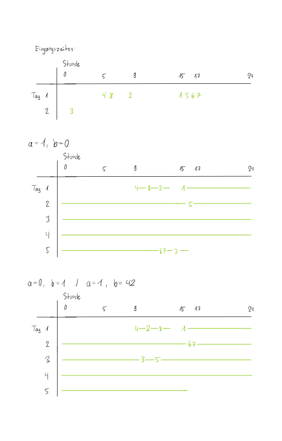

<h1 style="text-align: center;">Aufgabe 4: Fahrradwerkstatt</h1>

<p style="text-align: center;">Team-ID: 00968</p>

<p style="text-align: center;">Finn Rudolph</p>

<p style="text-align: center;">25. September 2022</p>

**Inhaltsverzeichnis**

[TOC]

## Lösungsidee

### Abarbeiten der Aufträge in Reihenfolge

Im Folgenden wird immer von Minuten als Zeiteinheit ausgegangen. Um die erste Teilaufgabe zu lösen, werden die Aufträge zunächst nach Eingangszeit sortiert. Das ist nötig, da von der Aufgabestellung eine aufsteigend sortierte Reihenfolge der Aufträge nicht garantiert ist. Anschließend können sie der Reihe nach abgearbeitet werden. Währenddessen soll ständig der aktuelle Zeitpunkt in einer Variablen aktualisiert werden, und für jeden Auftrag sein Zeitpunkt des Abschlusses abgespeichert werden. Damit kann später die mittlere und maximale Wartezeit berechnet werden. Zu Beginn wird der aktuelle Zeitpunkt auf den Eingangszeitpunkt des ersten Auftrags gesetzt. Falls dieser außerhalb von Marcs Arbeitszeiten liegt, wird der aktuelle Zeitpunkt auf den nächsten Beginn eines Arbeitstags gesetzt.

Bevor die Abarbeitung eines Auftrags beginnt, muss Folgendes beachtet werden. Falls die aktuelle Zeit vor dem Beginn des abzuarbeitenden Auftrags liegt, muss sie auf dessen Eingangszeit gesetzt werden. Das entspricht dem Fall, das Marc eine Zeit lang keine Aufträge hatte, da der Abschlusszeitpunkt des letzten Auftrags vor dem Eingangszeitpunkt des aktuellen Auftrags liegt. Beim Abarbeiten eines Auftrags muss berücksichtigt werden, dass er möglicherweise nicht in einen Tag passt und seine Wartezeit so die Nacht mit einschließt. Deshalb wird zunächst geprüft, ob der Auftrag noch im aktuellen Tag abschließbar ist. Wenn das möglich ist, kann einfach die aktuelle Zeit um die Dauer des Auftrags erhöht werden. Andernfalls wird die Dauer des Auftrags um die übrige Zeit bis 17 Uhr des aktuellen Tages reduziert. Dadurch kann der Auftrag so behandelt werden, als würde er direkt am Anfang des nächsten Arbeitstags um 9 Uhr starten. Der Zeitpunkt seines Abschlusses $t_{\text{Abschluss}}$ kann nun wie folgt berechnet werden (_Restdauer_ ist nur die übrige Dauer nach der eben beschriebenen Subtraktion, _Gesamtdauer_ die ursprüngliche Dauer):
$$
t_{\text{Abschluss}} = \text{aktuelle Zeit} + \bigg \lfloor \frac {\text{Restdauer}} {8 \cdot 60} + 1 \bigg \rfloor \cdot 16 \cdot 60 + \text{Gesamtdauer}
$$
Der Teil in der Abrundungsfunktion ist die Anzahl an Nächten, über die der Auftrag andauert ($+1$ wegen der zuvor übersprungenen Nacht). Zu dieser Zahl, multipliziert mit der Anzahl Minuten einer Nacht, muss noch die für den Auftrag benötigte Arbeitszeit addiert werden. Auch in diesem Fall wird die aktuelle Zeit auf $t_{\text{Abschluss}}$ gesetzt.

Um nun den Mittelwert aller Wartezeiten zu berechenen, wird $t_\text{Abschluss} - t_\text{Eingang}$, wobei $t_\text{Eingang}$ die Eingangszeit des Auftrags ist, für jeden Auftrag aufsummiert und durch $n$, die Anzahl der Aufträge, geteilt. Das Maximum wird durch Iteration über alle Aufträge mit einem laufend aktualisierten Maximum von $t_\text{Abschluss} - t_\text{Eingang}$ berechnet. Eine Anmerkung: Da Aufträge den gleichen Eingangszeitpunkt haben können, ist die Reihenfolge der Abarbeitung nicht eindeutig definiert, sodass sich trotz gleichem Verfahren unterschiedliche mittlere und maximale Wartezeiten ergeben können. Beispielsweise können sich diese unterscheiden, wenn in einer Implementierung der Sortieralgorithmus stabil sortiert, und in einer anderen Implementierung nicht.

### Kürzester Auftrag zuerst

Auch hier werden die Aufträge zunächst aufsteigend nach Eingangszeit sortiert. Jedoch soll hier immer der aktuell kürzeste bereits eingegangene Auftrag abgearbeitet werden. Um das zu erreichen, werden alle Aufträge, deren Eingangszeit kleiner oder gleich dem aktuellen Zeitpunkt ist, in eine Prioritätswarteschlange eingefügt, in der sie nach Dauer geordnet werden. Anschließend wird der Auftrag mit der kürzesten Dauer der Warteschlange entnommen und nach dem gleichen Ablauf wie im ersten Verfahren abgearbeitet. Auch der aktuelle Zeitpunkt wird wieder auf den Abschlusszeitpunkt des Auftrags gesetzt. Dieses Verfahren (Einfügen in die Warteschlange und Abarbeiten des kürzesten Auftrags) wird wiederholt, bis alle Aufträge abgearbeitet sind. Ähnlich wie in Teilaufgabe 1 muss auch hier die aktuelle Zeit auf die Eingangzeit des nächsten abzuarbeitenden Auftrags gesetzt werden, falls die aktuelle Zeit vor dieser liegt und die Warteschlange leer ist.

Dieses Verfahren ist ebenfalls problematisch, da die Eingangszeit eines Auftrags völlig außer Acht gelassen wird. So kann es passieren, dass ein lang dauernder Auftrag sehr lange aufgeschoben wird, wenn ständig kurze Aufträge eingehen. Es ist zwar nachvollziehbar, einige kurze Aufträge schnell abzuarbeiten, aber ab einem gewissen Zeitpunkt sollte die frühere Eingangszeit eines längeren Auftrags überwiegen.

### Priorisierung nach einer Kombination von Eingangszeit und Dauer

Zunächst soll eine neue Kennzahl vorgestellt werden, dann ein Verfahren zur Abarbeitung der Aufträge. Das Problem an der Kennzahl der durchschnittlichen Wartezeit ist, dass mehrere kleine Wartezeiten gleichwertig zu ihrer Summe sind. Beispielweise haben folgende Wartezeiten die gleiche mittlere Wartezeit ($n = 5$).
$$
0, 2, 5, 0, 2 \implies \text{Mittlere Wartezeit: } \frac {0 + 2+ 5 + 0 + 2} 5 = \frac 9 5 \\
0, 0, 0, 0, 9 \implies \text{Mittlere Wartezeit: } \frac {0 + 0 + 0 + 0 +9} 5 = \frac 9 5 \\
$$
Jedoch ist erstere Folge an Wartezeiten wesentlich erstrebenswerter, da die Wartezeit gleichmäßiger auf Kunden verteilt ist und nicht ein Kunde eine sehr hohe Wartzeit erfährt. Das würde in diesem Beispiel durch die maximale Wartezeit erfasst werden, jedoch bezieht sich diese nur auf einen einzigen Auftrag und ist deshalb auch nicht repräsentativ. Siehe folgendes Beispiel mit $n = 5$.
$$
6, 3, 3, 3, 3 \implies \text{Mittlere Wartezeit: } \frac {18} 5, \text{Maximale Wartezeit: } 6 \\
6, 6, 6, 0, 0 \implies \text{Mittlere Wartezeit: } \frac {18} 5, \text{Maximale Wartezeit: } 6 \\
$$
Hier die erste Folge aufgrund der faireren Verteilung an Wartezeit besser geeignet. Um die Gesamtwartezeit und Gleichmäßigkeit der Verteilung in einer Größe zu erfassen, soll die neue Größe der Durchschnitt der Quadrate der Wartezeiten sein. Die Werte für das erste Beispiele sind $33 / 5$ für die erste Folge und $81/5$ für die zweite Folge. Wie man sieht, hat die sehr große Wartezeit von $9$ bei der zweiten Folge den Ausschlag gegeben, dass der Durchschnitt der Quadrate höher ist. Für das zweite Beispiel sind die Werte $72/5$ für die erste Folge und $108/5$ für die zweite Folge. Auch hier wurde die ungleichmäßigere Verteilung erfasst. Man kann an dem Durchschnitt der Quadrate bemängeln, dass für eine gleichmäßigere Verteilung auch eine höhere durchschnittliche Wartezeit in Kauf genommen wird. Jedoch ist das aus Sicht eines Kunden, der eine sehr lange Wartezeit abbekommt, durchaus das Richtige.

Das Problem der beiden obigen Verfahren zur Abarbeitung von Aufträgen ist, dass sie nur eine der zwei gegebenen Größen eines Auftrags in Betracht ziehen. Das erste Verfahren achtet allein auf die Eingangszeit, das zweite Verfahren allein auf die Dauer. Daher ist es naheliegend, die Eingangszeit und Dauer zu einer Größe, die die Priorität eines Auftrags angibt, zu kombinieren. Die Idee dahinter ist, dass beide Kundenwünsche - das schnelle Abarbeiten kurzer Aufträge und keine sehr langen Wartezeiten - erfüllt werden können. Nimmt man beispielsweise die Summe aus Eingangszeit und Dauer als Priorität (geringerer Wert bedeutet höhere Priorität), kann ein kurzer Auftrag auch bei späterer Eingangszeit noch höher priorisiert sein. Geht er jedoch sehr viel später als ein längerer zuvor eingeangener Auftrag ein, wird er niedriger priorisiert. Allgemein: Sei $f(e, d)$ eine Funktion, die die Priorität eines Auftrags angibt, wobei $d$ die Dauer und $e$ die Eingangszeit des Auftrags ist. Kleinere Werte von $f$ bedeuten größere Priorität. Es ergeben sich sehr viele Möglichkeiten für $f$, einige Beispiele sind folgende ($a$ und $b$ sind Konstanten).
$$
f_1(e, d) = a\cdot e + b \cdot d \\
f_2(e, d) = a \cdot e + b \cdot d^2 \\
f_3(e, d) = a \cdot e + b^d
$$
Durch Veränderung von $f$ kann der Eingangszeit oder der Dauer eines Auftrags ein höherer Stellenwert zugewiesen werden. Beispielsweise ist bei $f_2$ die Dauer eines Auftrags entscheidender als bei $f_1$, und bei $f_3$ ist diese nochmal entscheidender als bei $f_2$. Die Zuweisungen der Priorität in den gegebenen Verfahren sind nur Spezialfälle mit $f(e, d) = e$ für das Abarbeiten der Aufträge in Reihenfolge und $f(e, d) = d$ für die Wahl des aktuell kürzesten Auftrags. Nun gilt es herauszufinden, welches $f$ einen geringstmöglichen Durchschnitt der Quadrate liefert. Dafür müssen schon Beispiele vorweggenommen werden. Nach einigen Versuchen stellten sich Werte von $f$ mit einem quadratischen oder exponentiellen Zusammenhang als ungeeignet heraus, da sie $e$ oder $d$ zu stark gewichten. Daher werden im Folgenden nur Funktionen $f(e, d) = a \cdot e + b \cdot d$ betrachtet. Die Mittelwerte der Quadrate der Wartezeiten sind für Beispielwerte von $a$ und $b$ in Tabelle 1 aufgelistet.

| $a, b$ | fahrradwerkstatt0.txt | fahrradwerkstatt1.txt | fahrradwerkstatt2.txt | fahrradwerkstatt3.txt | fahrradwerkstatt4.txt |
| ------ | --------------------- | --------------------- | --------------------- | --------------------- | --------------------- |
| 1, 0   | 1.48519e+09           | 5.94398e+09           | 3.37013e+09           | 1.21029e+09           | 7.62149e+09           |
| 0, 1   | 1.02768e+09           | 2.42656e+09           | 1.5388e+09            | 3.22712e+09           | 8.09416e+09           |
| 1, 1   | 1.42372e+09           | 5.87056e+09           | 3.09179e+09           | 1.18107e+09           | 7.38219e+09           |
| 1, 10  | 8.98935e+08           | 5.28238e+09           | 1.63148e+09           | 9.84819e+08           | 5.86953e+09           |
| 10, 1  | 1.47722e+09           | 5.91297e+09           | 3.31495e+09           | 1.1969e+09            | 7.58012e+09           |
| 2, 3   | 1.36578e+09           | 5.82826e+09           | 3.0155e+09            | 1.17472e+09           | 7.3076e+09            |
| 1, 18  | 8.53904e+08           | 4.80054e+09           | 1.16784e+09           | 8.65062e+08           | 5.34088e+09           |
| 1, 42  | 9.24319e+08           | 3.57496e+09           | 1.10003e+09           | 7.88014e+08           | 4.99621e+09           |

_Tabelle 1: Mittelwert der Quadrate der Wartezeiten für verschiedene Werte von $a$ und $b$._

Während des Testen erwiesen sich größere Werte von $b$ im Vergleich zu $a$ als vorteilhaft, daher sind mehr Beispiele in diese Richtung vorhanden. Um aus der Tabelle nun den besten Wert für $a, b$ herauszufinden, soll $a = 1, b = 0$ (entspricht Abarbeiten der Aufträge in Reihenfolge) als Referenz dienen. Die Ergebnisse mit anderen Werte von $a, b$ sollen prozentual zu den Referenzwerten ausgedrückt werden, sodass der Mittelwert dieser Prozentwerte über alle Beispieleingaben als Indikator für die Qualität von $a, b$ herangezogen werden kann. Ein geringerer Mittelwert bedeutet höhere Qualität. Die Ergebnisse dieser Berechnung sind in Tabelle 2 dargestellt. Es ist nötig, die Werte prozentual zu einem Referenzwert auszudrücken, da der Mittelwert der Quadrate für verschiedene Beispieleingaben in verschiedenen Größenordnungen liegen kann.

| $a, b$ | 1, 0  | 0, 1     | 1, 1     | 1, 10     | 10, 1     | 2, 3    | 1, 18     | 1, 42     |
| ------ | ----- | -------- | -------- | --------- | --------- | ------- | --------- | --------- |
|        | 0.0 % | -2.515 % | -3.837 % | -28.762 % | -18.670 % | -38.878 | -37.107 % | -42.863 % |

_Tabelle 2: Mittelwert der prozentualen Unterschiede des Mittelwerts der Quadrate für verschiedene Werte von $a, b$ zu $a = 1, b = 0$._

Man sieht, dass $a = 1, b = 0$ offensichtlich die schlechteste Strategie unter den gewählten für diese Beispieleingaben ist. Ein größerer Wert für $b$ im Vergleich zu $a$ ist tendenziell besser, bei $a = 1, b = 42$ wird der geringste Mittelwert der Quadrate erzielt. Die Kennzahl des Mittelwerts der Quadrate wird also durch vorgestelltes Verfahren mit $a = 1, b = 42$ deutlich geringer als durch die gegebenen Verfahren. Anzumerken ist, dass die Wahl $a = 1, b = 42$ sich für diese Beispieleingaben als geeignet herausgestellt hat. Bei anderen Beispielen könnten leicht andere Werte besser sein. Auch kann es sein, dass für diese Beipieleingaben noch bessere Werte als $a = 1, b = 42$ existieren, jedoch ist es nicht möglich, alle Kombinationen von $a$ und $b$ auszuprobieren.

Die Abarbeitung der Aufträge geschieht ähnlich wie im Verfahren 'Kürzester Auftrag zuerst'. Nur werden die Aufträge in der Prioritätswarteschlange nicht nach Dauer geordnet, sondern nach aufsteigendem Wert für $f$.

## Laufzeitanalyse

Sei $n$ die Anzahl der Aufträge. Dann beträgt die Laufzeit bei allen drei vorgestellten Verfahren $\Theta(n \log n)$. In allen Verfahren werden die Aufträge zunächst aufsteigend nach Eingangszeit sortiert, was in $\Theta (n \log n)$ möglich ist. Im Verfahren 'Kürzester Auftrag zuerst' und dem selbst entwickelten werden die Aufträge außerdem in einer Prioritätswarteschlange verwaltet. Da jeder Auftrag genau einmal in die Prioritätswarteschlange eingefügt und dieser entnommen wird und ein Einfügen bzw. Entnehmen bei einer solchen Warteschlange $O(\log n)$ Zeit benötigt, wird die gesamte Laufzeit dadurch nicht verändert. 

Die Speicherkomplexität beträgt $\Theta(n)$, da für jeden Auftrag nur eine konstante Anzahl an Attributen wie der Zeitpunkt der Fertigstellung abgespeichert wird.

## Implementierung

Das Programm wird in C++ geschrieben und für Linux x86-64 kompiliert. Da die vorgegebenen Verfahren nur Spezialfälle von dem selbst entwickelten sind, wird im Sinne der Vermeidung von Codewiederholung nur letzteres implementiert. Über zwei Argumente in der Kommandozeile können $a$ und $b$ angegeben werden. Auch kann das Argument `-t` mitgegeben werden, um neben den drei Kennzahlen der Wartezeiten auch die Abschlusszeit jedes Auftrags ausgeben zu lassen. Wichtig ist jedoch, dass die Werte von $a$ und $b$ direkt aufeinander folgen und $a$ vor $b$ angegeben wird. Der Befehl zum Ausführen des Programms könnte mit $a = 1, b = 42$ wie folgt aussehen.

```
./aufgabe4 < beispiele/fahrradwerkstatt0.txt 1 42 -t
```

Die vorgegebenen Verfahren können, wie bereits erklärt, mit $a = 1, b = 0$ für das Abarbeiten der Aufträge in Reihenfolge und $a = 0, b = 1$ für die Priorisierung des aktuell kürzesten Auftrags erreicht werden.

Zunächst werden in `main` die Aufträge eingelesen und dem Vektor `tasks` hinzugefügt (Z. 116-123). Danach werden die Argumente der Kommandozeile verarbeitet und Werte für $a$ und $b$ gesetzt (Z. 125-134).

Anschließend werden die Aufträge mithilfe von `std::sort` nach aufsteigender Eingangszeit sortiert (Z. 136). Hierfür wird als Vergleichsfunktion eine Instanz der Struktur `task_priority_comp` verwendet - diese Struktur dient dazu, eine Vergleichsfunktion für verschiedene Werte von $a$ und $b$ erhalten zu können. Da die Aufträge zunächst nach Eingangszeit sortiert werden, ist $a = 1, b = 0$. Durch Überladen des Operators `()` kann die Struktur als Vergleichsfunktion für `std::sort` mitgegeben werden. Anschließend wird die durch das Sortieren erzeugte Permutation der Aufträge in einem Vektor abgespeichert, die später benötigt wird (Z. 139-141). Die aktuelle Zeit `curr_time` wird durch die Funktion `init_curr_time`, wie in der Lösungsidee beschrieben, entweder auf den Startzeitpunkt des ersten Auftrags oder den nächsten Arbeitstag gesetzt (Z. 143). Hierfür sind einige weitere Hilfsfunktionen nötig, die auch später gebraucht werden: `minutes` gibt die Anzahl an Minuten der als Argument gegebenen Stunden zurück, `day_start` berechnet den Startzeitpunkt des aktuellen Tages in Minuten.

Nach Anlegen der Prioritätswarteschlange `q` (Z. 144-147) beginnt der eigentliche Algorithmus. Der Iterator `it` zeigt immer zu dem Auftrag in `tasks`, der als nächstes eingehen wird. Die äußere `while`-Schleife wird solange ausgeführt, bis alle Aufträge abgearbeitet sind, denn wenn `it != tasks.end()` oder `!q.empty()` sind noch unbearbeitet Aufträge in `tasks ` oder der Warteschlange. Die Zeilen 152-153 behandeln den Fall, dass Marc eine Zeit warten muss, da sein letzter Auftrag vor dem Beginn des aktuellen fertiggestellt wurde. Anschließend werden alle bereits eingegangenen Aufträge zur Prioritätswarteschlange hinzugefügt (Z. 154-158). Hierbei muss auf den Fall geachtet werden, dass bereits alle Aufträge eingegangen sind und `it` deshalb bei `tasks.end()` steht. Dann kann das Hinzufügen sofort beendet werden. Als letzter Schritt wird der Auftrag mit aktuell höchster Priorität der Warteschlange entnommen und von der Funktion `do_task` abgearbeitet. Wichtig ist, das nur der oberste Auftrag und nicht die gesamte Warteschlange abgearbeitet wird, denn durch das Vergrößern von `curr_time` nach Abarbeiten eines Auftrags könnten bereits neue Aufträge eingegangen sein.

`do_tasks` arbeitet einen Auftrag nach dem zweischrittigen Verfahren ab, das in der Lösungsidee beschrieben wurde (Z. 62-75). Zunächst wird die Abschlusszeit des Auftrags auf das Minimum der Dauer des Auftrags und der übrigen Zeit des Arbeitstags gesetzt, und die Dauer des Auftrags um die Zeit reduziert, die am aktuellen Tag abgearbeitet werden kann (Z. 67-68). Falls der Auftrag in den aktuellen Tag passt, ist `t.len` gleich 0 und Z. 72 wird nicht ausgeführt. Andernfalls wird die Abschlusszeit nach der in der Lösungsidee genannten Formel vergrößert. Schließlich wird die neue aktuelle Zeit zurückgegeben.

## Beispiele

In allen Beispielen wird die Ausgabe für die geforderten Verfahren mit $a = 1, b = 0$ und $a = 0, b = 1$ sowie die experimentell besten gefundenen Werte $a = 1, b = 42$ angegeben.

### fahrradwerkstatt0.txt

```
2389 1325
6430 427
10620 1541
10620 4032
...
510300 1267
525009 1339
```

Ausgabe für $a = 1, b = 0$.

```
Mittlere Wartezeit: 32999.3
Maximale Wartezeit: 68771
Mittelwert der Quadrate: 1.48519e+09
```

Ausgabe für $a = 0, b = 1$.

```
Mittlere Wartezeit: 16981.3
Maximale Wartezeit: 188734
Mittelwert der Quadrate: 1.02768e+09
```

Ausgabe für $a = 1, b = 42$.

```
Mittlere Wartezeit: 17083.2
Maximale Wartezeit: 168786
Mittelwert der Quadrate: 9.24319e+08
```

### fahrradwerkstatt1.txt

```
1980 13
3420 202
9412 166
12060 182
...
524700 191
524777 59
526140 17
```

Ausgabe für $a = 1, b = 0$.

```
Mittlere Wartezeit: 63699.3
Maximale Wartezeit: 128321
Mittelwert der Quadrate: 5.94398e+09
```

Ausgabe für $a = 0, b = 1$.

```
Mittlere Wartezeit: 11883.9
Maximale Wartezeit: 433563
Mittelwert der Quadrate: 2.42656e+09
```

Ausgabe für $a = 1, b = 42$.

```
Mittlere Wartezeit: 44226.3
Maximale Wartezeit: 165628
Mittelwert der Quadrate: 3.57496e+09
```

### fahrradwerkstatt2.txt

```
3420 1339
4918 17
10620 16
12391 14
...
514620 14
516147 17
525009 17
```

Ausgabe für $a = 1, b = 0$.

```
Mittlere Wartezeit: 51431.6
Maximale Wartezeit: 110973
Mittelwert der Quadrate: 3.37013e+09
```

Ausgabe für $a = 0, b = 1$.

```
Mittlere Wartezeit: 14813.5
Maximale Wartezeit: 327087
Mittelwert der Quadrate: 1.5388e+09
```

Ausgabe für $a = 1, b = 42$.

```
Mittlere Wartezeit: 15682.1
Maximale Wartezeit: 186014
Mittelwert der Quadrate: 1.10003e+09
```

### fahrradwerkstatt3.txt

```
1980 1238
3420 437
3420 1354
4918 15
...
520477 1469
523660 1224
525029 1454
```

Ausgabe für $a = 1, b = 0$.

```
Mittlere Wartezeit: 30174
Maximale Wartezeit: 60821
Mittelwert der Quadrate: 1.21029e+09
```

Ausgabe für $a = 0, b = 1$.

```
Mittlere Wartezeit: 17242.8
Maximale Wartezeit: 382016
Mittelwert der Quadrate: 3.22712e+09
```

Ausgabe für $a = 1, b = 42$.

```
Mittlere Wartezeit: 18893.8
Maximale Wartezeit: 66712
Mittelwert der Quadrate: 7.88014e+08
```

### fahrradwerkstatt4.txt

```
7740 3494
12391 3360
13500 3864
14940 187
...
510300 1483
513180 14
523260 2957
```

Ausgabe für $a = 1, b = 0$.

```
Mittlere Wartezeit: 74641
Maximale Wartezeit: 167059
Mittelwert der Quadrate: 7.62149e+09
```

Ausgabe für $a = 0, b = 1$.

```
Mittlere Wartezeit: 42200.9
Maximale Wartezeit: 374699
Mittelwert der Quadrate: 8.09416e+09
```

Ausgabe für $a = 1, b = 42$.

```
Mittlere Wartezeit: 46530
Maximale Wartezeit: 188588
Mittelwert der Quadrate: 4.99621e+09
```

### fahrradwerkstatt5.txt

Dieses sehr kleine Beispiel dient dazu, die Korrektheit manuell genau überprüfen zu können.

```
0 55
600 480
700 40
710 55
720 90
```

Ausgabe für $a = 1, b = 0$ mit `-t`.

```
Mittlere Wartezeit: 1269
Maximale Wartezeit: 1505
Mittelwert der Quadrate: 1.72554e+06
Abschlusszeiten:
595 2040 2080 2135 2225
```

Ausgabe für $a = 0, b = 1$ mit `-t`.

```
Mittlere Wartezeit: 1269
Maximale Wartezeit: 1505
Mittelwert der Quadrate: 1.72554e+06
Abschlusszeiten:
595 2040 2080 2135 2225
```

Ausgabe für $a = 1, b = 42$ mit `-t`.

```
Mittlere Wartezeit: 1269
Maximale Wartezeit: 1505
Mittelwert der Quadrate: 1.72554e+06
Abschlusszeiten:
595 2040 2080 2135 2225
```

Dass die Ausgabe in allen drei Fällen die gleiche ist, stimmt tatsächlich.

### fahrradwerkstatt6.txt

Auch anhand von diesem kleinen Beispiel soll die Korrektheit des Programms überprüft werden können.

```
900 540
502 89
1490 120
300 78
970 1200
980 3
1024 94
321 99
```

Ausgabe für $a = 1, b = 0$ mit `-t`.

```
Mittlere Wartezeit: 3036.38
Maximale Wartezeit: 5553
Mittelwert der Quadrate: 1.5149e+07
Abschlusszeiten:
2400 806 6697 618 6480 6483 6577 717 
```

Ausgabe für $a = 0, b = 1$ mit `-t`.

```
Mittlere Wartezeit: 1772.25
Maximale Wartezeit: 5727
Mittelwert der Quadrate: 5.96586e+06
Abschlusszeiten:
2400 707 3577 618 6697 2403 3457 806 
```

Ausgabe für $a = 1, b = 42$ mit `-t`.

```
Mittlere Wartezeit: 1772.25
Maximale Wartezeit: 5727
Mittelwert der Quadrate: 5.96586e+06
Abschlusszeiten:
2400 707 3577 618 6697 2403 3457 806 
```

Hier ergeben sich Unterschiede zwischen der ersten und zweiten Ausgabe. Der Fall $a = 1, b = 42$ verhält sich jedoch gleich zu $a = 0, b = 1$. Mithilfe von Abbildung 1 kann nachvollzogen werden, dass die Ausgabe in allen drei Fällen korrekt ist.



### fahrradwerkstatt7.txt

Dieses Beispiel soll zeigen, dass das Programm aufgrund der Laufzeit von $\Theta(n \log n)$ auch mit sehr großen Eingaben gut zurechtkommt. Es gilt $n = 10^5$, die Startzeiten wurden von einem Zahlengenerator gleichverteilt aus $[1, 10^5]$ ausgewählt. Die Dauer der Aufträge wurde gleichverteilt aus $[1, 2 \cdot 10^4]$ ausgewählt.

```
7056	3264
20751	12051
46550	5224
38388	1866
...
8202	13542
86238	4293
36903	4866
```

Ausgabe für $a = 1, b = 0$.

```
Mittlere Wartezeit: 1.49773e+09
Maximale Wartezeit: 2996082836
Mittelwert der Quadrate: 2.99116e+18
```

Ausgabe für $a = 0, b = 1$.

```
Mittlere Wartezeit: 9.97704e+08
Maximale Wartezeit: 2996151592
Mittelwert der Quadrate: 1.79342e+18
```

Ausgabe für $a = 1, b = 42$.

```
Mittlere Wartezeit: 1.00108e+09
Maximale Wartezeit: 2996083144
Mittelwert der Quadrate: 1.8e+18
```

Ausgabe für $a = 1, b = 20$.

```
Mittlere Wartezeit: 1.01175e+09
Maximale Wartezeit: 2996083144
Mittelwert der Quadrate: 1.82029e+18
```

Ausgabe für $a = 1, b = 100$.

```
Mittlere Wartezeit: 9.98317e+08
Maximale Wartezeit: 2996083144
Mittelwert der Quadrate: 1.79463e+18
```

Ausgabe für $a = 1, b = 1000$.

```
Mittlere Wartezeit: 9.9771e+08
Maximale Wartezeit: 2996083144
Mittelwert der Quadrate: 1.79344e+18
```

In diesem Beispiel ist das selbst entwickelte Verfahren leicht schlechter als $a = 0, b = 1$. Mit den zusätzlichen Werten für $a = 1$ und $b = 20, 100, 1000$ scheint es, dass $a = 0, b = 1$ für dieses Beispiel optimal ist, und sich der Mittelwert der Quadrate mit größer werdendem $b$ asymptotisch dem für $a = 0, b = 1$ annähert.

### fahrradwerkstatt8.txt

Dieses Beispiel weist im Gegensatz zu _fahrradwerkstatt7.txt_ sehr ungleich verteilte Eingangszeiten auf.

```
90 434
1002 67
1443 793
1444 8
1454 73
1590 893
1733 84
1909 1
1902 1
1902 1
8444 14
6783 38
9090 123
7239 773
169 3
1992 892
1 2
5 33
3 3333
4 901
7 273
3 99
19002 82
19002 773
19000 636
19622 182
19623 181
```

Ausgabe für $a = 1, b = 0$.

```
Mittlere Wartezeit: 14594.1
Maximale Wartezeit: 21799
Mittelwert der Quadrate: 2.38262e+08
```

Ausgabe für $a = 0, b = 1$.

```
Mittlere Wartezeit: 4998.93
Maximale Wartezeit: 26656
Mittelwert der Quadrate: 6.31617e+07
```

Ausgabe für $a = 1, b = 42$.

```
Mittlere Wartezeit: 5055
Maximale Wartezeit: 26656
Mittelwert der Quadrate: 6.00065e+07
```

Hier gelingt es $a = 1, b = 42$ einen geringeren Durchschnitt der Quadrate der Wartezeiten als die beiden gegebenen Verfahren zu erzielen. 

## Quellcode

```cpp
#include <iostream>
#include <vector>
#include <queue>
#include <algorithm>
#include <string.h>

struct task
{
    int64_t start, len, completion;
    size_t i;
};

// Geringerer Wert bedeutet höhere Priorität.
inline int64_t priority(task const &t, int64_t a, int64_t b)
{
    return a * t.start + b * t.len;
}

struct task_priority_comp
{
    int64_t a, b;
    task_priority_comp(int64_t a_, int64_t b_)
    {
        a = a_;
        b = b_;
    }

    bool operator()(task const &x, task const &y) const
    {
        return priority(x, a, b) < priority(y, a, b);
    }
};

void print_result(std::vector<task> const &tasks)
{
    long double mean_time = 0.0, squares_mean = 0.0;
    int64_t max_time = 0;
    for (task const &t : tasks)
    {
        mean_time += (t.completion - t.start);
        max_time = std::max(max_time, t.completion - t.start);
        squares_mean += (t.completion - t.start) * (t.completion - t.start);
    }
    mean_time /= (long double)tasks.size();
    squares_mean /= (long double)tasks.size();

    std::cout << "Mittlere Wartezeit: " << mean_time << '\n'
              << "Maximale Wartezeit: " << max_time << '\n'
              << "Mittelwert der Quadrate: " << squares_mean << '\n';
}

inline int64_t minutes(int64_t hours)
{
    return hours * 60;
}

inline int64_t day_start(int64_t m)
{
    return (m / minutes(24)) * minutes(24);
}

// Aktualisiert die Abschlusszeit des Auftrags und gibt die neue aktuelle Zeit
// zurück.
inline int64_t do_task(task &t, int64_t curr_time)
{
    // Fülle den aktuellen Arbeitstag auf, falls der Auftrag so lange dauert.
    t.completion = std::min(curr_time + t.len, (day_start(curr_time) + minutes(17)));
    t.len -= (t.completion - curr_time);

    if (t.len)
        // Füge auch die Zeit der Nächte hinzu, die der Auftrag andauert.
        t.completion += (t.len / minutes(8) + 1) * minutes(16) + t.len;

    return t.completion;
}

inline int64_t init_curr_time(task const &t)
{
    int64_t curr_time = t.start;

    // Behandelt den Fall, dass ein Auftrag außerhalb der Arbeitszeit eingeht.
    if (curr_time % minutes(24) < minutes(9))
        curr_time = day_start(curr_time) + minutes(9);
    else if (curr_time % minutes(24) > minutes(17))
        curr_time = day_start(curr_time) + minutes(24) + minutes(9);

    return curr_time;
}

void print_completion_times(std::vector<task> &tasks)
{
    std::cout << "Abschlusszeiten:\n";
    std::vector<int64_t> times(tasks.size());
    for (task const &t : tasks)
        times[t.i] = t.completion;
    for (int64_t c : times)
        std::cout << c << ' ';
    std::cout << '\n';
}

inline void print_help()
{
    std::cout << "Gebrauch:\n"
              << "  ./aufgabe4 [a] [b]\n"
              << "  optional: -t zum Ausgeben der Abschlusszeiten\n";
}

int main(int argc, char **argv)
{
    if (argc != 3 && argc != 4)
    {
        print_help();
        return 0;
    }

    std::vector<task> tasks;
    size_t z = 0;
    while (std::cin.peek() != EOF)
    {
        int64_t start, len;
        std::cin >> start >> len;
        tasks.push_back({start, len, 0, z++});
    }

    int64_t a = 0, b = 0;
    bool print_times = 0;
    for (int i = 1; i < argc; i++)
        if (!strcmp(argv[i], "-t"))
            print_times = 1;
        else
        {
            a = std::stoul(argv[i]);
            b = std::stoul(argv[++i]);
        }

    std::sort(tasks.begin(), tasks.end(), task_priority_comp(1, 0));

    // Die Permutation der Aufträge.
    std::vector<size_t> p(tasks.size());
    for (size_t i = 0; i < tasks.size(); i++)
        p[tasks[i].i] = i;

    int64_t curr_time = init_curr_time(tasks[0]);
    // Die C++ std::priority_queue ordnet Elemente absteigend, daher müssen a
    // und b negiert werden.
    std::priority_queue<task, std::vector<task>, task_priority_comp>
        q(task_priority_comp(-a, -b));

    auto it = tasks.begin();
    while (it != tasks.end() || !q.empty())
    {
        if (q.empty())
            curr_time = std::max(curr_time, it->start);
        while (it != tasks.end() && it->start <= curr_time)
        {
            q.push(*it);
            it++;
        }

        curr_time = do_task(tasks[p[q.top().i]], curr_time);
        q.pop();
    }

    print_result(tasks);
    if (print_times)
        print_completion_times(tasks);
}
```

