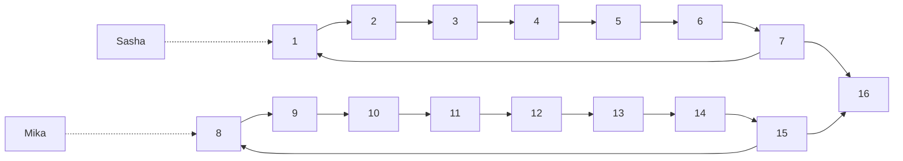

<h1 style="text-align: center;">Aufgabe 5: Hüpfburg</h1>

Team-ID: 00968

Finn Rudolph

21. September 2022

**Inhaltsverzeichnis**

[TOC]

## Lösungsidee

### Erklärung des Algorithmus

Der Parcours kann als gerichteter Graph repräsentiert werden, indem jedes Feld einem Knoten und jede Verbindung einer Kante zugeordnet wird, sodass genau dann eine Kante von Knoten $a$ zu Knoten $b$ existiert, wenn es eine Verbindung zwischen den zugehörigen Feldern gibt. Die Aufgabenstellung lautet dann, zu entscheiden, ob es von Knoten $1$ und $2$ einen Knoten mit gleicher Entfernung gibt. Gelöst werden kann dies durch jeweils eine Breitensuche von $1$ und $2$. Die Idee dabei ist, für jeden Knoten jede Entfernung vom Startknoten abzuspeichern, mit der er erreicht werden kann. Da der Graph Zyklen enthalten kann, können das unendlich viele sein. $n$ bezeichnet im Folgenden die Anzahl der Knoten, $m$ die Anzahl der Kanten. Eine wichtige Einsicht ist, dass es ausreicht, alle Entfernungen bis zur Länge von $n^2$ in Betracht zu zu ziehen, was später bewiesen werden soll. Damit wird für jeden Knoten ein Array von Länge $n^2$ mit Wahrheitswerten angelegt, das bei Index $i$ $\text{true}$ enthält, wenn der Knoten durch einen Pfad der Länge $i$ erreichbar ist. Ein weiteres Array derselben Länge enthält den Vorgängerknoten auf dem Pfad. 

Die Breitensuche wird mithilfe einer Warteschlange durchgeführt, die zunächst nur das Paar $(u, 0)$, wobei $u$ der Startknoten ist. Das zweite Feld des Paares enthält die Anzahl an Schritten, mit denen der Knoten erreicht wurde. Folgende Schritte werden solange wiederholt, bis die Warteschlange leer ist. Zunächst wird das vorderste Paar $(x, d)$ von der Warteschlange genommen. Dann wird bei allen Nachbarn von $x$ geprüft, ob der Nachbar mit einem Pfad der Länge $d + 1$ erreichbar ist. Falls nicht, wird das Paar $(\text{Nachbar}, d + 1)$ zur Warteschlange hinzugefügt. Dies geschieht natürlich nur, wenn $d + 1 \le n^2$. Nach Ende dieses Ablaufs steht so in dem Array jedes Knoten, mit welchen Pfadlängen und über welche Vorgänger er von $u$ erreichbar ist.

Schließlich muss die Breitensuche nur noch von Knoten $1$ und $2$ ausgeführt werden und für jeden Knoten überprüft werden, ob er von $1$ und $2$ mit einem gleich langen Pfad erreichbar ist. 

### Oberschranke für die Länge eines erfolgreichen Pfads

Um die Oberschranke von $n^2$ zu beweisen, soll zunächst bewiesen werden, dass ein Pfad von größerer Länge als $n-1$ Zyklen enthalten muss. Die Länge eines Pfads ist die Anzahl darin enthaltender Kanten, wobei mehrfach besuchte Kanten mehrfach gezählt werden. Ein Pfad mit Länge $l > n-1$ hat mehr als $n$ Knoten, daher muss ein Knoten nach dem Schubfachprinzip mehrfach vorkommen. Die Knoten des Pfads werden als $p_1, p_2, \dots p_{l+1}$ bezeichnet. Wenn der Knoten bei Index $i$ das erste mal und bei Index $j$ das zweite Mal auftritt, dann ist die Knotenfolge $p_i, p{i+1}, \dots, p_j$ ein Zyklus, da für jedes $k : i \le k \le j$ gilt, dass $p_k$ und $p_{k+1}$ durch eine Kante verbunden sind.

Damit müssen im Folgenden nur Pfade mit Zyklen in Betracht gezogen werden. Auch soll angenommen werden, dass der Parcours erfolgreich abschließbar ist. Als weitere Annahme wird nur der kürzeste erfolgreiche Pfad betrachtet. Aus diesen Annahmen folgt, dass sowohl Sasha als auch Mika auf ihren Pfaden den gleichen oder verschiedene Zyklen durchlaufen müssen. Sei $l_1$ die Länge von Sashas Zyklus und $l_2$ die Länge von Mikas Zyklus. Jeder Zyklus enthält einen Knoten (genannt $t_1$ und $t_2$), sodass Sasha genau dann bei $t_1$ stehen muss, wenn Mika bei $t_2$ steht, um den Zyklus im nächsten Schritt zu verlassen und Parcours erfolgreich absolvieren zu können. Die zentrale Erekenntnis ist, dass nach $\text{lcm}(l_1, l_2)$ Schritten die Ausgangssituation wiederhergestellt ist und sich der Ablauf danach wiederholt. Daher müssen in diesen $\text{lcm}(l_1, l_2)$ Schritten alle erreichbaren Kombinationen von Knoten, an denen Sasha bzw. Mika steht, erreicht worden sein. Aus der Annahme, dass der Parcours erfolgreich absolvierbar ist, folgt, dass $t_1$ und $t_2$ nach spätestens $\text{lcm}(l_1, l_2)$ gleichzeitig erreicht werden müssen. Da $\text{lcm}(x, y) \le xy$ für positive Ganzzahlen $x, y$, ist der Parcours nach maximal $l_1l_2$ Schritten erfolgreich absolviert. Und da $l_1, l_2 \le n$, ist $n^2$ eine obere Schranke für die Anzahl benötigter Schritte.

_Abbildung 1: Beispielgraph mit einem Zyklus von Länge 7 und einem Zyklus von Länge 8. Hier gilt $l_1 = 7, l_2 = 8$ und $t_1 = 7, t_2 = 15$_

In dem Beweis wurde außerdem angenommen, dass beide gleichzeitig den Zyklus betreten. Das verändert die Oberschranke nicht, da z. B. Kanten nach Mikas Zyklus vor diesen gelegt werden könnten, sodass Mika seinen Zyklus später betritt, und die Gesamtlänge des Pfads unverändert bliebe. Auch wurde nicht in Betracht gezogen, dass ein erfolgreicher Pfad mehrere Zyklen enthalten könnte. Auch das verändert die Oberschranke nicht, denn wenn einer der beiden seinen Zyklus verlässt und in einen neuen eintritt, kann dieser Zyklus unabhängig vom vorherigen betrachtet werden. Seien $l_1, l_2, \dots, l_k$ alle Zykellängen eines Spielers und $l_\max$ die größte Zykellänge des anderen Spielers. Dann ist 
$$
l_1 l_\max + l_2 l_\max + \dots + l_k l_\max = l_\max(l_1 + l_2 + \dots l_k) \le n^2
$$
erneut eine Oberschranke.

## Laufzeitanalyse

 Für die Laufzeitanalyse soll gezählt werden, wie oft eine Kante gebraucht werden kann, um die Arrays eines Nachbarknoten zu aktualisieren. Sei die Kante $(u, v)$. Die Kante kann von jeder der Distanzen von $0$ bis $n^2$ von $u$ aus und von $v$ aus maximal ein mal gebraucht werden. Daher werden allein für die Kante $(u, v)$ $O(2n^2) = O(n^2)$ Rechenschritte durchgeführt. Summiert man für alle Kanten auf, beträgt die gesamte Worst-Case Zeitkomplexität $O(mn^2)$. Der spätere Vergleich der Arrays von der Breitensuche von Knoten $1$ und $2$ aus bewegt sich ebenfalls in dieser Schranke, da für jeden Knoten $n^2$ Rechenschritte durchgeführt werden. Unter der Annahme, dass der Graph verbunden ist, ist $m = \Omega (n)$.

Die Speicherkomplexität beträgt $\Theta(n^3)$, da für jeden Knoten ein Array von Länge $n^2$ angelegt wird.

## Implementierung

## Beispiele

## Quellcode

