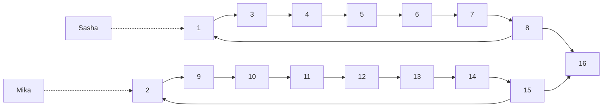

<h1 style="text-align: center;">Aufgabe 5: Hüpfburg</h1>

<p style="text-align: center;">Team-ID: 00968</p>

<p style="text-align: center;">Finn Rudolph</p>

<p style="text-align: center;">25. September 2022</p>

**Inhaltsverzeichnis**

[TOC]

## Lösungsidee

### Erklärung des Algorithmus

Der Parcours kann als gerichteter Graph repräsentiert werden, indem jedes Feld einem Knoten und jede Verbindung einer Kante zugeordnet wird, sodass genau dann eine Kante von Knoten $a$ zu Knoten $b$ existiert, wenn es eine Verbindung zwischen den zugehörigen Feldern gibt. Die Aufgabenstellung lautet dann, zu entscheiden, ob es von Knoten $1$ und $2$ einen Knoten mit gleicher Entfernung gibt. Gelöst werden kann dies durch jeweils eine Breitensuche von $1$ und $2$. Die Idee dabei ist, für jeden Knoten jede Entfernung vom Startknoten abzuspeichern, mit der er erreicht werden kann. Da der Graph Zyklen enthalten kann, kann die Entfernung beliebig groß werden. $n$ bezeichnet im Folgenden die Anzahl der Knoten, $m$ die Anzahl der Kanten. Eine wichtige Einsicht ist, dass es ausreicht, alle Entfernungen bis zur Länge von $n^2$ in Betracht zu zu ziehen, was später bewiesen werden soll. Die folgende Beschreibung bezieht sich auf eine Breitensuche. Es wird für jeden Knoten ein Array von Länge $n^2$ mit Wahrheitswerten angelegt, das bei Index $i$ _true_ enthält, wenn der Knoten durch einen Pfad der Länge $i$ erreichbar ist. Ein weiteres Array derselben Länge enthält für jede Distanz den Vorgängerknoten auf dem Pfad vom Startknoten zu diesem Knoten.

Die Breitensuche wird mithilfe einer Warteschlange durchgeführt, die zunächst nur das Paar $(u, 0)$ enthält, wobei $u$ der Startknoten ist. Das erste Feld des Paares ist der Knoten, das zweite enthält die Anzahl an Schritten, mit denen der Knoten erreicht wurde. Folgende Schritte werden solange wiederholt, bis die Warteschlange leer ist. Zunächst wird das vorderste Paar $(x, d)$ von der Warteschlange genommen. Dann wird bei allen Nachbarn von $x$ geprüft, ob der Nachbar mit einem Pfad der Länge $d + 1$ erreichbar ist. Falls nicht, wird das Paar $(\text{Nachbar}, d + 1)$ zur Warteschlange hinzugefügt. Dies geschieht natürlich nur, wenn $d + 1 \le n^2$. Nach Ende dieses Ablaufs steht so in dem Array jedes Knoten, mit welchen Pfadlängen und über welche Vorgänger er vom Startknoten der Breitensuche erreichbar ist.

Schließlich muss die Breitensuche nur noch von Knoten $1$ und $2$ ausgeführt werden und für jeden Knoten überprüft werden, ob er von $1$ und $2$ mit einem gleich langen Pfad erreichbar ist. 

### Oberschranke für die Länge eines erfolgreichen Pfads

Um die Oberschranke von $n^2$ zu beweisen, soll zunächst bewiesen werden, dass ein Pfad von größerer Länge als $n-1$ Zyklen enthalten muss. Die Länge eines Pfads ist die Anzahl darin enthaltender Kanten, wobei mehrfach besuchte Kanten mehrfach gezählt werden. Ein Pfad mit Länge $l > n-1$ passiert mehr als $n$ Knoten, daher muss ein Knoten nach dem Taubenschlagprinzip mehrfach vorkommen. Die Knoten des Pfads werden als $p_1, p_2, \dots p_{l+1}$ bezeichnet. Wenn der Knoten bei Index $i$ das erste mal und bei Index $j$ das zweite Mal auftritt, dann ist die Knotenfolge $p_i, p_{i+1}, \dots, p_j$ ein Zyklus, da (per Definition eines Pfads) für jedes $k : i \le k < j$ gilt, dass $p_k$ und $p_{k+1}$ durch eine Kante verbunden sind.

Damit müssen im Folgenden nur Pfade mit Zyklen in Betracht gezogen werden. Auch soll angenommen werden, dass der Parcours erfolgreich abschließbar ist. Auch wird nur der kürzeste erfolgreiche Pfad betrachtet. Sasha und Mika müssen auf ihren Pfaden den gleichen oder verschiedene Zyklen durchlaufen. Sei $l_1$ die Länge von Sashas Zyklus und $l_2$ die Länge von Mikas Zyklus. Jeder Zyklus enthält einen Knoten (genannt $t_1$ und $t_2$), sodass Sasha genau dann bei $t_1$ stehen muss, wenn Mika bei $t_2$ steht, um den Zyklus im nächsten Schritt zu verlassen und Parcours erfolgreich absolvieren zu können. Die zentrale Erkenntnis ist, dass nach $\text{lcm}(l_1, l_2)$ Schritten die Ausgangssituation wiederhergestellt ist und sich der Ablauf danach wiederholt. Denn nach $\text{lcm}(l_1, l_2)$ Schritten hat Sasha seinen Zyklus $\text{lcm}(l_1, l_2) / l_1$ (muss eine Ganzzahl sein per Definition des kleinsten gemeinsamen Vielfachen) mal umrundet und Mika seinen Zyklus $\text{lcm}(l_1, l_2) / l_2$ mal. Daher müssen in diesen $\text{lcm}(l_1, l_2)$ Schritten alle erreichbaren Kombinationen von Knoten, an denen Sasha bzw. Mika steht, erreicht worden sein. Aus der Annahme, dass der Parcours erfolgreich absolvierbar ist, folgt, dass $t_1$ und $t_2$ nach spätestens $\text{lcm}(l_1, l_2)$ gleichzeitig erreicht werden müssen. Da $\text{lcm}(x, y) \le xy$ für positive Ganzzahlen $x, y$, ist der Parcours nach maximal $l_1l_2$ Schritten erfolgreich absolviert. Und da $l_1, l_2 \le n$, ist $n^2$ eine obere Schranke für die Anzahl benötigter Schritte.



_Abbildung 1: Beispielgraph mit einem Zyklus von Länge 7 und einem Zyklus von Länge 8. Hier gilt $l_1 = 7, l_2 = 8$ und $t_1 = 8, t_2 = 15$. Nach $55$ Schritten erreicht Sasha $7$ und Mika $15$. Das zeigt, dass die Schranke $\text{lcm}(l_1, l_2)$ für zwei Zyklen nicht verrringert werden kann._

In dem Beweis wurde außerdem angenommen, dass beide gleichzeitig den Zyklus betreten. Ist das nicht der Fall, ist die Oberschranke dennoch die selbe, da z. B. Kanten nach Mikas Zyklus vor diesen gelegt werden könnten, sodass Mika seinen Zyklus später betritt, und die Gesamtlänge des Pfads unverändert bleibt. Auch wurde nicht in Betracht gezogen, dass ein erfolgreicher Pfad mehrere Zyklen enthalten könnte. Das verändert die Oberschranke ebenfalls nicht, denn wenn einer der beiden seinen Zyklus verlässt und in einen neuen eintritt, kann dieser Zyklus unabhängig vom vorherigen betrachtet werden. Seien $l_1, l_2, \dots, l_k$ alle Zykellängen eines Spielers und $l_\max$ die größte Zykellänge des anderen Spielers. Dann ist 
$$
l_1 l_\max + l_2 l_\max + \dots + l_k l_\max = l_\max(l_1 + l_2 + \dots l_k) \le n^2
$$
erneut eine Oberschranke.

Eine Anmerkung: Sei $d_1$ Distanz von Sasha zu $t_1$ beim Betreten seines Zyklus und $d_2$ die Distanz von Mika zu $t_2$ beim Betreten seines Zyklus. Das erfolgreiche Absolvieren eines Graphen wie in Abbildung 1 ist genau dann möglich, wenn $d_1 \equiv d_2 \space \bmod \gcd(l_1, l_2)$.

## Laufzeitanalyse

Für die Laufzeitanalyse soll gezählt werden, wie oft eine Kante gebraucht werden kann, um die Arrays eines Nachbarknoten zu aktualisieren. Im Folgenden soll die Kante $(u, v)$ betrachtet werden. Sie kann von jeder der Distanzen von $0$ bis $n^2$ von $u$ aus und von $v$ aus maximal ein mal gebraucht werden. Daher werden allein für die Kante $(u, v)$ $O(2n^2) = O(n^2)$ Rechenschritte durchgeführt. Summiert man für alle Kanten auf, beträgt die Worst-Case Zeitkomplexität $O(mn^2)$. Der spätere Vergleich der Arrays von der Breitensuche von Knoten $1$ und $2$ aus bewegt sich ebenfalls in dieser Schranke, da für jeden Knoten $n^2$ Rechenschritte durchgeführt werden. Unter der Annahme, dass der Graph verbunden ist, ist $m = \Omega (n)$.

Die Speicherkomplexität beträgt $\Theta(n^3)$, da für jeden Knoten ein Array von Länge $n^2$ angelegt wird.

## Implementierung

Das Programm wird in C++ implementiert. Im ersten Teil des Programms (Z. 34-43 in `main`) wird der Graph eingelesen und als Adjazenzliste in der Variable `g` gespeichert. Diese Repräsentation eines Graphen eignet sich hier besonders, da schnell über alle Nachbarknoten eines Knoten iteriert werden muss. Dagegen ist es nicht nötig, schnell überprüfen zu können, ob ein bestimmter Knoten mit einem einem anderen Knoten verbunden ist (wofür eine Adjazenzmatrix oder -map besser geeignet wäre).

Der zweite Teil des Programms (Z. 45-54 in `main`) besteht aus der Breitensuche von Knoten 1 und 2 aus, diese Knoten sind im Code aufgrund der 0-Indexierung 0 und 1. Vor der Breitensuche werden vier zweidimensionale Arrays angelegt: `r1` und `pre1` speichern die Erreichbarkeit und den Vorgänger bei der Breitensuche von Knoten $1$, genauso `r2` und `pre2` für Knoten $2$ (Z. 45-51). Die Breitensuche wird von der Funktion `get_reachable` durchgeführt. Sie funktioniert über eine `std::queue` von `pair<size_t, size_t>`. Nach dem Entfernen eines Elements von der Warteschlange in der `while`-Schleife wird vom aktuellen Knoten `x` jeder seiner Nachbarn `y` auf mögliche neue Erreichbarkeit geprüft (Z. 18-28). Wenn ein Knoten mit `d + 1` noch nicht erreicht wurde, wird das Paar `x, d + 1` zur Warteschlange hinzugefügt (Z. 25-27). Dieses Verfahren endet, wenn die Warteschlange leer ist.

Schließlich wird für jede Distanz überprüft, ob ein Knoten von 1 und 2 gleichzeitig erreichbar ist (Z. 56-83). Ist das der Fall, werden die zwei Pfade über die Vorgängerarrays rekonstruiert und in den Vektoren `path1` und `path2` gespeichert. Dazu werden die aktuellen Knoten (`x` für Sashas Pfad, `y` für Mikas Pfad) dem jeweiligen Vektor hinzugefügt und dann auf deren Vorgänger gesetzt, bis kein Vorgänger mehr existiert (Z. 62-72). `i` muss dabei in jedem Schritt um 1 verringert werden, da die Distanz zum Startknoten der Breitensuche beim Vorgänger um 1 geringer ist. Da die Pfade in umgekehrter Reihenfolge rekonstruiert wurden, werden sie in umgekehrter Reihenfolge ausgegeben (Z. 74-80). Danach terminiert das Programm (Z. 82). Falls kein erfolgreicher Pfad gefunden wurde, wird diese Information ausgegeben (Z. 85).

## Beispiele

### huepfburg0.txt

```
20 44
1 18
1 8
1 4
2 3
2 19
3 19
3 6
5 15
5 12
5 13
6 2
6 12
7 5
7 8
8 18
8 4
9 4
9 1
9 14
10 16
10 3
10 12
10 18
11 19
12 3
13 7
13 10
14 17
14 16
14 10
14 18
14 1
15 12
16 11
16 20
16 17
16 19
17 11
17 9
18 13
18 7
19 20
20 3
20 10
```

```
benötigte Sprünge: 3

Sashas Pfad:
1 18 13 10 

Mikas Pfad:
2 19 20 10 
```

### huepfburg1.txt

```
17 18
1 2
2 3
3 4
4 5
5 6
6 7
7 8
8 9
9 10
10 11
11 12
12 13
13 14
14 15
15 16
16 17
17 1
1 4
```

```
benötigte Sprünge: 121

Sashas Pfad:
1 4 5 6 7 8 9 10 11 12 13 14 15 16 17 1 4 5 6 7 8 9 10 11 12 13 14 15 16 17 1 4 5 6 7 8 9 10 11 12 13 14 15 16 17 1 4 5 6 7 8 9 10 11 12 13 14 15 16 17 1 4 5 6 7 8 9 10 11 12 13 14 15 16 17 1 4 5 6 7 8 9 10 11 12 13 14 15 16 17 1 4 5 6 7 8 9 10 11 12 13 14 15 16 17 1 4 5 6 7 8 9 10 11 12 13 14 15 16 17 1 4 

Mikas Pfad:
2 3 4 5 6 7 8 9 10 11 12 13 14 15 16 17 1 2 3 4 5 6 7 8 9 10 11 12 13 14 15 16 17 1 2 3 4 5 6 7 8 9 10 11 12 13 14 15 16 17 1 2 3 4 5 6 7 8 9 10 11 12 13 14 15 16 17 1 2 3 4 5 6 7 8 9 10 11 12 13 14 15 16 17 1 2 3 4 5 6 7 8 9 10 11 12 13 14 15 16 17 1 2 3 4 5 6 7 8 9 10 11 12 13 14 15 16 17 1 2 3 4 
```

In diesem Graphen überschneiden sich viele Knoten der Zyklen von Sasha und Mika, die Zyklen sind jedoch unterschiedlich. Sasha durchläuft den Zyklus $1, 4, 5, \dots, 17, 1$, wohingegen Mika den Zyklus $1, 2, 3, \dots, 17, 1$ verwendet. Der Graph ist der Kreisgraph $C_{17}$ mit der zusätzlichen Kante $(1, 4)$. 

Durch Verändern der letzten Zeile der Eingabedatei konnte interessanterweise festgestellt werden, dass sich die größte Anzahl an benötigten Sprüngen ergibt, wenn die zusätzliche Kante von 1 nach 4 geht. Geht diese beispielsweise von Knoten 1 zu 14, verwendet Sasha den Zyklus $1, 14, 15, 16, 17, 1$ und Mika den gleichen Zyklus wie zuvor, es werden nur 46 Sprünge benötigt.

### huepfburg2.txt

```
150 347
1 82
66 82
118 82
1 51
51 82
...
114 4
114 6
114 70
```

```
benötigte Sprünge: 8

Sashas Pfad:
1 51 76 59 42 65 54 92 27 

Mikas Pfad:
2 24 53 2 106 136 108 100 27 
```

### huepfburg3.txt

```
24 41
1 3
3 4
4 5
5 2
2 6
6 7
7 8
8 1
9 10
10 11
11 12
12 13
13 14
14 15
15 16
16 9
23 17
17 18
18 19
20 21
21 22
22 23
1 10
10 4
4 19
6 21
21 8
8 9
9 3
3 11
11 5
5 13
13 6
6 15
23 3
17 11
19 24
24 20
19 2
24 14
15 22
```

```
Absolvieren des Parcours nicht möglich.
```

### huepfburg4.txt

```
100 181
100 2
3 2
3 4
5 4
5 6
...
90 1
1 99
100 12
```

```
benötigte Sprünge: 16

Sashas Pfad:
1 99 89 79 78 77 76 66 56 55 54 44 43 33 23 13 12 

Mikas Pfad:
2 12 11 100 2 12 11 100 2 12 11 100 2 12 11 100 12 
```

### huepfburg5.txt

```
2 2
1 2
2 1
```

```
Absolvieren des Parcours nicht möglich.
```

Dieses Beispiel entspricht dem Kreisgraphen $C_2$. Sasha und Mika können jeweils Plätze tauschen, jedoch nie auf dem gleichen Feld landen.

### huepfburg6.txt

```
16 17
1 3
3 4
4 5
5 6
6 7
7 8
8 1
8 16
2 9
9 10
10 11
11 12
12 13
13 14
14 15
15 2
15 16
```

```
benötigte Sprünge: 56

Sashas Pfad:
1 3 4 5 6 7 8 1 3 4 5 6 7 8 1 3 4 5 6 7 8 1 3 4 5 6 7 8 1 3 4 5 6 7 8 1 3 4 5 6 7 8 1 3 4 5 6 7 8 1 3 4 5 6 7 8 16 

Mikas Pfad:
2 9 10 11 12 13 14 15 2 9 10 11 12 13 14 15 2 9 10 11 12 13 14 15 2 9 10 11 12 13 14 15 2 9 10 11 12 13 14 15 2 9 10 11 12 13 14 15 2 9 10 11 12 13 14 15 16 
```

Der Graph entspricht dem in Abbildung 1.

### huepfburg7.txt

```
197 198
1 2
2 3
3 4
4 5
5 6
...
195 196
196 197
197 1
1 4
```

Der Graph ist identisch zu `huepfburg1.txt`, außer dass der größte Zyklus aus 197 statt 17 Knoten besteht. Der Graph ist $C_{197}$, mit der Ausnahme, dass eine zusätzliche Kante von 1 zu einem anderen Knoten $v$ (in der Textdatei $v = 4$) ausgeht. 197 wurde gewählt, da es eine Primzahl ist und das Absolvieren des Pfads somit für jedes $v$ möglich ist. Die Ausgabe für $v = 4$ ist wie folgt (abgekürzt aufgrund der großen Länge).

```
benötigte Sprünge: 19111

Sashas Pfad:
1 4 5 6 7 8 9 10 ... 196 197 1 4 5 ...

Mikas Pfad:
2 3 4 5 6 7 8 9 10 ... 196 197 1 2 3 ...
```

Nach Austesten einiger anderer Werte für $v$ wurde auch hier der höchste Wert für $v = 4$ festgestellt. Begründet werden kann das dadurch, dass durch diese Wahl $\text{lcm}(l_1, l_2)$ maximiert wird. Bei $v = 4$ ist dieses beispielsweise $\text{lcm}(197, 195) = 38415$, für $v = 19$ nur $\text{lcm}(197, 170) = 33490$ und $v = 190$ nur $\text{lcm}(197, 8) =  1576$. Eine Erklärung für den Zusammenhang ist, dass Sasha Mika schneller überrunden kann, wenn er eine weiter reichende Abkürzung hat, so treffen sie sich früher.

### huepfburg8.txt

```
6
1 2
1 4
1 6
3 2 
3 4
3 6
5 2
5 4
5 6
2 1
2 3
2 5
4 1
4 3
4 5
6 1
6 3
6 5
```

```
Absolvieren des Parcours nicht möglich.
```

Der vorliegende Graph ist bipartit (der vollständige bipartite Graph $K_{3, 3}$ mit jeweils drei Knoten pro Partition). Da Sasha und Mika in unterschiedlichen Partitionen starten und mit einem Schritt jeweils nur zur anderen Partition gelangen können, werden sie nie in der gleichen Partition und damit an einem gleichen Knoten sein können.

### huepfburg9.txt

```
6 18
1 3
1 4
1 6
2 3
2 4
2 6
5 3
5 4
5 6
3 1
3 2
3 5
4 1
4 2
4 5
6 1
6 2
6 5
```

```
benötigte Sprünge: 1

Sashas Pfad:
1 3 

Mikas Pfad:
2 3 
```

Der Graph ist wie `huepfburg8.txt` bipartit, jedoch starten Sasha und Mika in der gleichen Partition.

## Quellcode

```cpp
#include <iostream>
#include <vector>
#include <queue>
#include <tuple>

void get_reachable(
    std::vector<std::vector<size_t>> const &g,
    size_t u,
    std::vector<std::vector<bool>> &reachable,
    std::vector<std::vector<size_t>> &pre)
{
    reachable[u][0] = 1;
    std::queue<std::pair<size_t, size_t>> q;
    q.push({u, 0});

    while (!q.empty())
    {
        auto [x, dis] = q.front();
        q.pop();

        // Markiere noch nicht erreichte Nachbarn als erreichbar.
        for (size_t y : g[x])
            if (dis + 1 < reachable[0].size() && !reachable[y][dis + 1])
            {
                reachable[y][dis + 1] = 1;
                pre[y][dis + 1] = x;
                q.push({y, dis + 1});
            }
    }
}

int main()
{
    size_t n, m;
    std::cin >> n >> m;

    std::vector<std::vector<size_t>> g(n);
    for (size_t i = 0; i < m; i++)
    {
        size_t a, b;
        std::cin >> a >> b;
        g[a - 1].push_back(b - 1);
    }

    // Enthält bei [i][j], ob Vertex i von Vertex 0 bzw. 1 mit j Sprüngen
    // erreichbar ist.
    std::vector<std::vector<bool>> r1(n, std::vector<bool>(n * n, 0)),
        r2(n, std::vector<bool>(n * n, 0));
    // Enthält den Vorgänger von i nach j Sprüngen bei [i][j].
    std::vector<std::vector<size_t>> pre1(n, std::vector<size_t>(n * n, -1)),
        pre2(n, std::vector<size_t>(n * n, -1));

    get_reachable(g, 0, r1, pre1);
    get_reachable(g, 1, r2, pre2);

    for (size_t i = 0; i < n * n; i++)
        for (size_t u = 0; u < n; u++)
            if (r1[u][i] && r2[u][i])
            {
                std::cout << "benötigte Sprünge: " << i << "\n\n";

                // Rekonstruktion des Pfads von Vertex 0 bzw. 1.
                std::vector<size_t> path1, path2;
                size_t x = u, y = u;
                while (x != SIZE_MAX)
                {
                    path1.push_back(x);
                    path2.push_back(y);
                    x = pre1[x][i];
                    y = pre2[y][i];
                    i--;
                }

                std::cout << "Sashas Pfad:\n";
                for (auto it = path1.rbegin(); it != path1.rend(); it++)
                    std::cout << (*it + 1) << ' ';
                std::cout << "\n\nMikas Pfad:\n";
                for (auto it = path2.rbegin(); it != path2.rend(); it++)
                    std::cout << (*it + 1) << ' ';
                std::cout << '\n';

                return 0;
            }

    std::cout << "Absolvieren des Parcours nicht möglich.\n";
}
```

